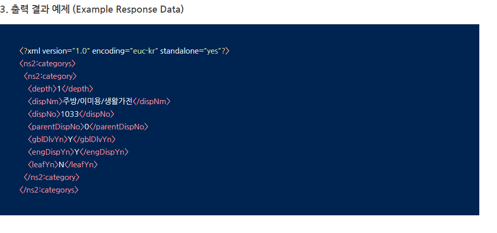

# (Lotte ON) 11번가 출점 RestAPI 개발 정리 (2일차)


  ### 11번가 API 개발 시작하기  

​	1.  11번가 상품 카테고리 조회하기  Seller - 상품 - 전체 카테고리 조회 

​		 11번가 전체 카테고리 정보를 조회하기 앞서 11번가의 경우 API key 값이 따로 필요하지 않는다. 

  	 2. URL 
       - http://api.11st.co.kr/rest/cateservice/category


3.  출력 결과 예제(Example Response Data)

​		

 위에 URL을 호출하면 해당 XML 형태로 Response 값이 돌아온다. 


#### JAVA 

1. Controller 

   ```java
   @RequestMapping(value = "/ximarket/getXiSampleCategoryList")
      public ResponseEntity getXiSampleCategoryList() throws Exception{
   
           XiSampleSearchDTO xiSampleSearchDTO = new XiSampleSearchDTO();
           xiSampleSearchDTO.setSearchCode("1");
           xiSampleSearchDTO.setSearchName("카테고리명");
   
           Object object = sampleService.getXiSampleCategoryList(xiSampleSearchDTO);
   
           log.debug("/ximarket/getXiSampleCategoryList 정상실행");
   
          return new ResponseEntity<>(object, HttpStatus.OK);
       }
   
   ```

 - 프로젝트 초에 부서 부장님께서 만드신 샘플 코드이다. 

 - XiSampleSeachDTO의 경우 카테고리를 조회하기 위해 Header에 담아 보낸 정보를 객체에 

   Set 한다.

   ```java
   package com.lottemart.api.ximarket.sample.domain;
   
   import com.fasterxml.jackson.dataformat.xml.annotation.JacksonXmlProperty;
   import com.fasterxml.jackson.dataformat.xml.annotation.JacksonXmlRootElement;
   import lombok.Getter;
   import lombok.Setter;
   
   @Getter
   @Setter
   @JacksonXmlRootElement(localName = "SearchDTO")
   public class XiSampleSearchDTO {
   
   
       @JacksonXmlProperty(localName = "Code")
       private String searchCode;
   
       @JacksonXmlProperty(localName = "Name")
       private String searchName;
   
   }
   
   ```

   - Root 는 "SearchDTO"로 잡아주고 하위에 "Code", "Name" 을  묶어준다. 

     ```xml
     <SearchDTO>
         <Code>1</Code>
         <name>카테고리명</name>
     </SearchDTO>
     ```

 - 객체에서 요런 형식으로 xml 이 생성되어 보내질 예정이다. 

 - Object  object = sampleService.getXiSampleCategoryList(xiSampleSearchDTO)에 객체로 

   세팅한 값을 보내준다. 


##### - 개발정리 3일차에 Service 부분 이어서 작성 합니다. - 

