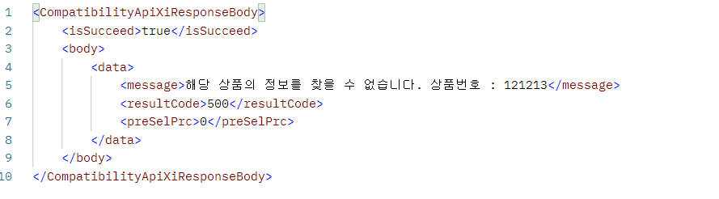

# (Lotte ON) 11번가 출점 RestAPI 개발(@PathVariable 사용하기)

#### JAVA 

1. @PathVariable ->URL 경로 변수 넣어주기 

  - 사용법 
    : http:/localhost/open/member/mypage/10   ( 10을 따로 꺼내서 변수로 사용하는 것)
  - 경로의 특정 위치 값이 고정되지 않고 달라질 때 사용하는 것 
  - @ RequestMapping의 URL 정의 &  Method내의 파리미터 부분의 정의 
  - -> @RequestMapping 어노테이션 값으로 {템플릿 변수}를 사용하는 것 
  - -> @PathVariable 어노테이션을 이용해서 {템플릿 변수} 와 동일한 이름을 갖는 파라미터를 추가 
  - -> RequestMapping에 있는 변수를 PathVariable이 적용된 동일한 이름의 파라미터에 매핑됨 

<br>
<br>

#### 주의 

- null이나 공백값이 들어가는 파라미터는 적용되지 않음 
- @PathVariable으로 값을 넘겨받을때 값에 '.' 가 포함되어 있으면 ',' 가 포함하여 그 뒤가 잘려서 들어온다

<br>
<br>

#### 2. 예제 

``` java
    @ApiOperation(value = "판매 중지 처리", notes = "판매 중지 처리")
	@PutMapping(value = "/status/stopDisplay/{prodCd}")
	public ResponseEntity<CompatibilityApiXiResponseBody> statusStopDisplay(@PathVariable(value = "prodCd", required = true) String prodCd) throws Exception {

		CompatibilityApiXiResponseBody response = productService.statusStopDisplay(prodCd);

		log.debug("/ximarket/product/status/stopDisplay/" + prodCd + " 정상실행");

		return new ResponseEntity<CompatibilityApiXiResponseBody>(response, HttpStatus.OK);
	}
```

 - http://localhost:8084/oneapp/ximarket/product/status/stopDisplay/121213 <br> 
   해당 형식으로  PostMan 실습을하였다. 

<br>
<br>
<br>


#### 3. 예제실습 결과 




- 결과로 해당 121213 상품번호가 해당 템플릿변수에 동일한 이름값으로 세팅된 것을 확인할 수 있다.


