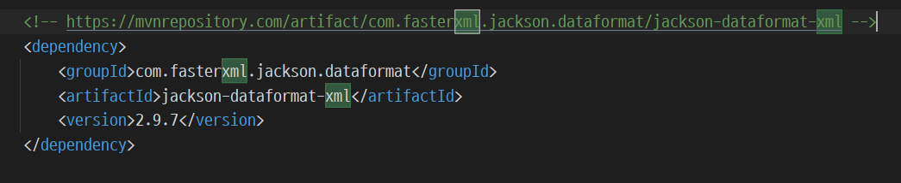
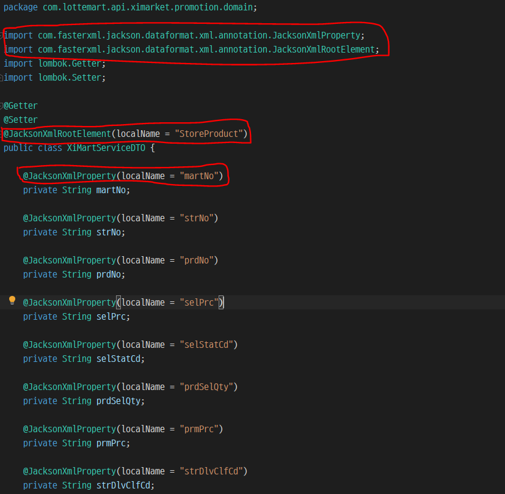
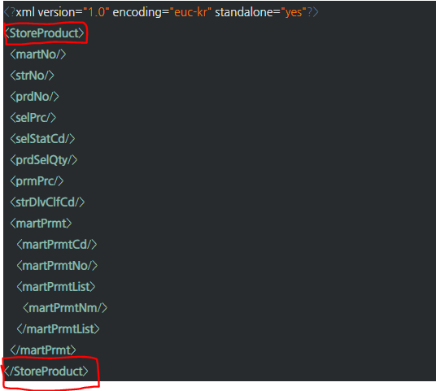
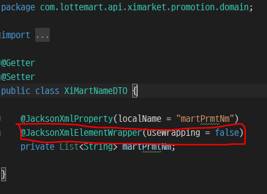

# (Lotte ON)11번가 출점 RestAPI 개발 정리 (1일차)

### @JacksonXmlProperty(localName = "") 사용 

 REST API에서 받아오는 데이터의 형식은 JSON 타입이 많다. 

 11번가 Open API 정책에는 리턴 값을 XML 형식으로 되어  있다. 

  REST API로 XML을 어떻게 변환하는지 확인해보자 

1. Jackson Dataformat XML dependency 추가 

  

  설명 :  XML 형식 데이터 <-> Java 오브젝트 로 상호 변환하게 해주는 라이브러리

​			  Jackson Dataformat XML을 pom.xml에  그림과 같이 추가해준다. 

​			 프로젝트에 사용되었던 버전은 2.9.7 입니다. 

 2. 출력할 데이터 형식 정의 

  	

​	   설명 :  (필드명의 경우 개발 초기 단계라 변경 될 가능성이 높다. )  11번가에 전송할 데이터 필드명

​	   을 정의해 준 뒤 (롬복 사용) @JacksonXmlRootElement, @JacksonXmlProperty  를 사용한다. 

어노테이션 설명 

#####     @JacksonXmlRootElement(localName = "StoreProduct" ); 

- localName으로 설정한 값을 루트 요소로 지정한다. 

- localName을 지정하지 않으면 클래스명이 지정된다. (localName 명시 해주는 것이 좋다)

- 

-  상위 그림에서 빨간색 상자에 표시된 <StoreProduct> 태그가 최 상위 태그로 사용되어 있기

   때문에  @JacksonXmlRootElement(localName = "StoreProduct") 로 사용해준다. 

  

##### @JacksonXmlProperty(localName = "martNo" ); 

- 루트 요소 안에 들어갈 하위 요소들을 지정한다. 

- isAttribute = true 로 지정하면 루트태그의 속성으로 들어가게 된다 

- 마찬가지로 localName 속성을 지정하면 지정한 값으로 요소가 표기된다. 

- StoreProduct 안에 필드 들이 대상이 된다. (martNo, strNo 등등)

  

##### @JacksonXmlElementWrapper(userWrapping= false); 

- 이 어노테이션에 지정된 값을 요소로 묶을 것인지 결정하는 역할을 한다.  (기본값은 true )

- 

  

- < martPrmtList >  태그 안에는  <martPrmtNm> 태그들이 List 형태로 여러개  작성할 

  예정이지만  그대로 출력할 경우 

  ~~~xml
  <martPrmtList>
  	<martPrmtNm>
      	<martPrmtNm>블라블라1/martPrmtNm>
      	<martPrmtNm>블라블라2/martPrmtNm>
    </martPrmtNm>
  </martPrmtList>
  ~~~

​		이런 형태로 지정된 값을 요소로 묶여  XML이 출력된다  그러나 위의 형태는 틀린 형태이기에

~~~xml
<martPrmtList>
    	<martPrmtNm>블라블라1/martPrmtNm>
    	<martPrmtNm>블라블라2/martPrmtNm>
</martPrmtList>
~~~

 	지정된 값을 요소로 묶지 않은 형태로 출력하기 위해 false로 작성해 준다. 

​	

이상으로 Jackson Dataformat XML dependency 사용법 및 해당 어노테이션에 대해 간략하게 

정리해보았다.
