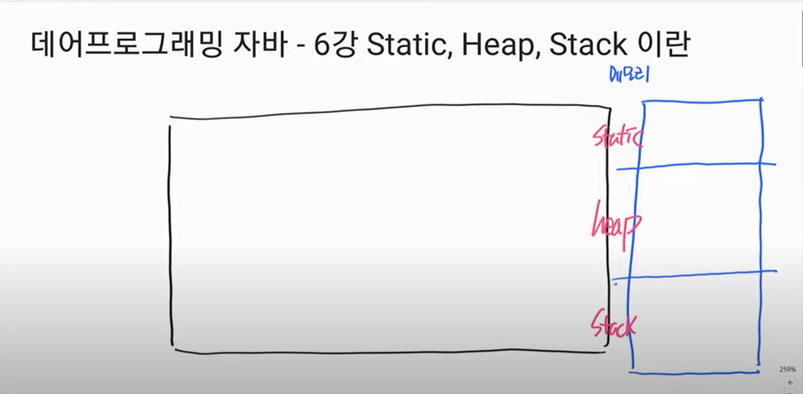
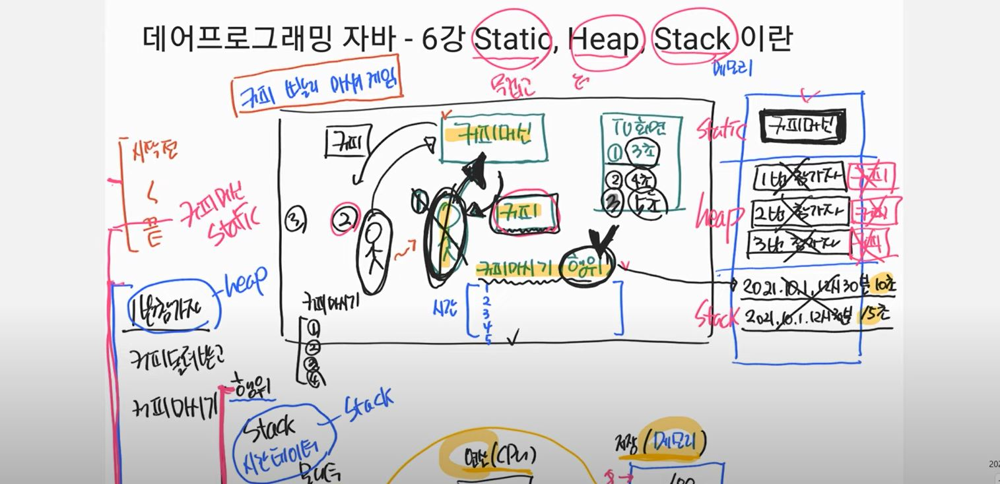

# [JAVA]  static, heap, stack 메모리에 관하여

출처 : 데어프로그래밍 유튜브

### 메모리란? 

메모리는 "컴퓨터의 저장영역" 서랍처럼 생겼으며 데이터를 담을 수 있는 공간이다. 

**정리**

1. 컴퓨터의 저장영역이며 데이터를 담을 수 있는 공간이다.

2. 메모리 공간에 해당하는 각각의 주소가 존재한다. 

3. CPU는 연산을 담당하는 기계 장치이며 주소에 해당하는 데이터를 가져와서 연산을 진행한다. 

4. 연산이 완료 된 데이터를 메모리 빈공간에 다시 담는다. 

5. 우리는 모니터를 통해 메모리에 저장된 값을 "출력" 하여 볼 수 있다. 

**자바에서의 메모리공간**

가. static 메모리  
    - 메모리 생존주기가 가장 긴 메모리 JVM이 항상 메모리 공간을 할당한다.  
나. heap 메모리  
    - 메모리 생존주기가 보통 메모리가 생성된 순간과 지워지는 순간이 있다.  
다. stack 메모리  
    - 메모리 생존주기가 가장 짧은 메모리 

 

> **커피마시기 게임** 

1. static 메모리에 올라오는 것 : 커피머신 
2. heap 메모리에 올라오는 것 : 대회참가자, 커피
3. stack 메모리에 올라오는 것 : 참가자가 커피를 마시는 시간 

