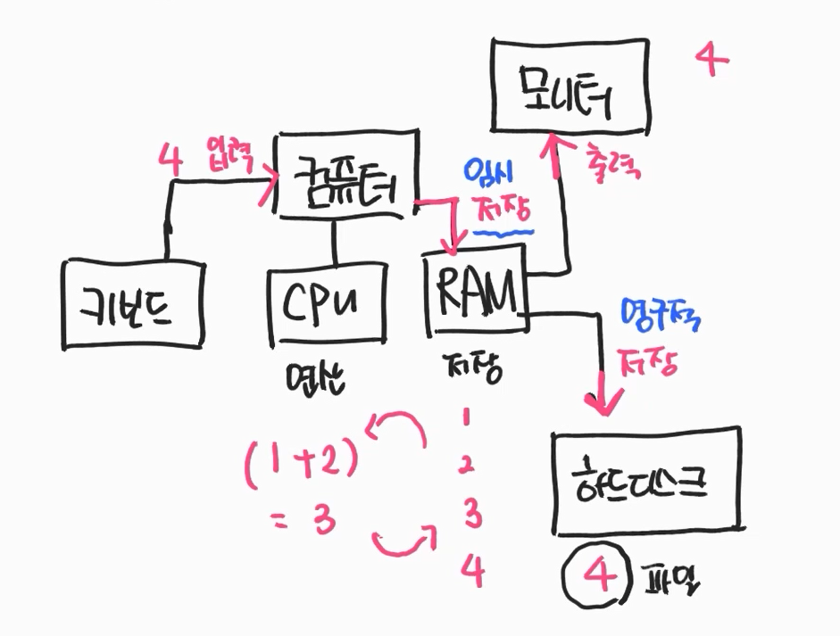
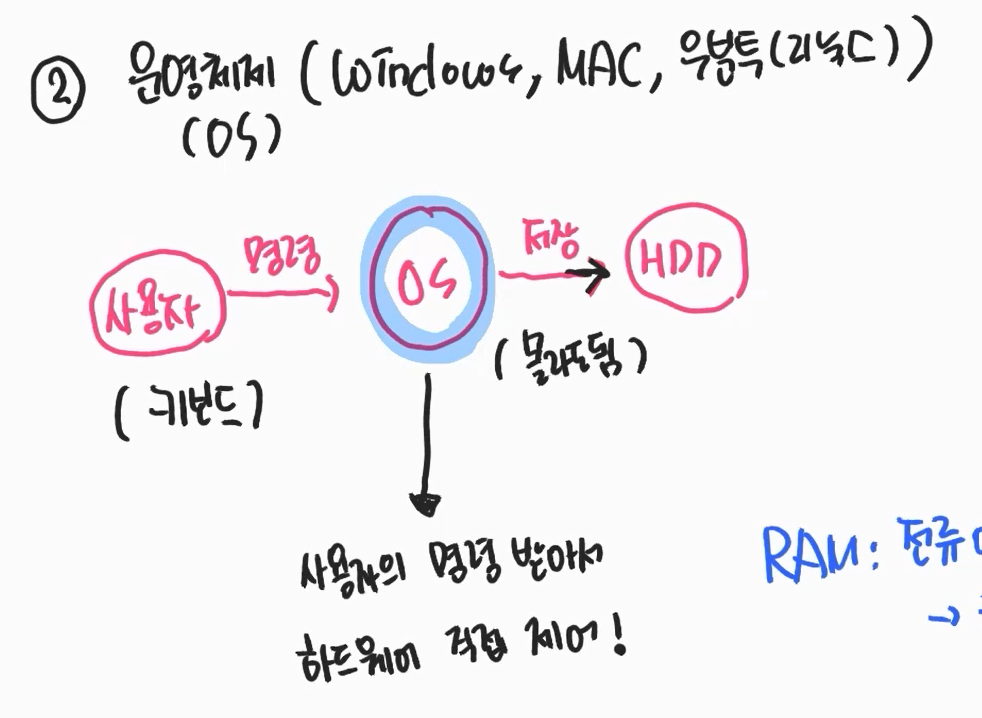
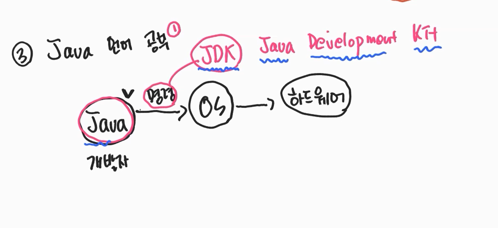
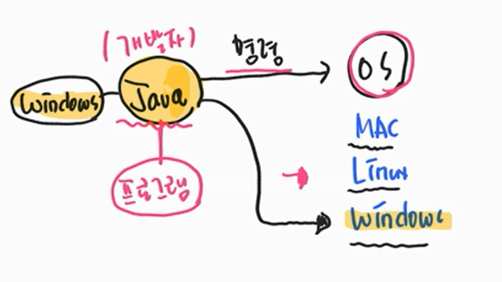

# [JAVA]  컴퓨터란?

출처 : 데어프로그래밍 강의

### 컴퓨터의 구성

 
**컴퓨터의 구성 **

1. CPU 는 '연산' RAM 은 '저장' 을 담당한다

2. CPU가 RAM에 저장된 값을 꺼내 연산을 진행한다.

3. 사용자는 키보드로 값을 입력한다.

4. 입력된 값은 RAM에 저장되고 CPU에게 연산을 명령한다.

5. 모니터는 값을 출력한다.

6. 하드디스크는 RAM에 임시 저장된 값을 하드디스크에 스크래치 내어 값을 영구 저장하는데, 파일 형태로 저장

 
 
 

### OS의 역할 

1. 운영체제란 사용자의 명령을 받아 하드웨어를 직접 제어하는 역할

 
 
 

### 자바 프로그래밍이란? 

1. 자바언어를 통해 OS에 명령하고 하드웨어를 직접 제아하는 것 
2. JDK 란 Java Development Kit로 자바언어를 OS에 통역해주는 역할이다.   
3. MAC, Linux, Windows에 맞게 JDK를 설치 해야한다. 
4. JDK 설치는 https://jdk.java.net/ 링크로 들어가서 다운받자! 

 
 

