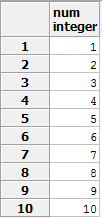

# [Postgresql]  RECURSIVE 문 원리 및 예제


Recursive의 뜻이 '재귀'이다.  계층형 SQL 문을 작성할 때 쓰는 Postgresql 기능이며 대부분

회사에서는 계층형구조를 만들 때  보통 트리 구조의 데이터를 만들 때 많이 사용했다.


### RECURSIVE 문 기본 구조

<hr>

 ```sql
WITH RECURSIVE 뷰 이름 AS(
    초기 SQL
    UNION ALL(OR UNION)
    반복할 SQL(+반복을 멈출 where절 포함)
)SELECT * FROM 뷰 이름;
 ```

**원리**

1. 초기 SQL을 실행하면 실행한 결과셋은 recursive문을 선언할때 기재한 뷰에 담긴다.

2. 반복할 SQL의 from 절에 뷰명을 이용해서 처리하거나 한다. 이는 상황에 따라 다르지만 주로 뷰명을 from절에 두고 반복문을 돌리는 것이 일반적이다.

3. union 혹은 union all 연산을 한다.(경우에따라 다름 마이너스도 가능)

4. 반복할 SQL에서 단하나의 레코드가 나오지 않을때 recursive문을 탈출한다.

5. recursive문을 탈출하였으면 뷰명에 연산된 결과셋이 다시 담기게되고 뷰처럼 조회할 수 있다.


**예제**

\- 1개의 컬럼으로 10개의 레코드가 1~10형태로 나올 recursive 문을 짜시오.

```sql
WITH RECURSIVE VIEWNAME AS(
    SELECT 1 AS num
 
    UNION ALL 
 
    SELECT num+1 FROM VIEWNAME WHERE num < 10
)select * from VIEWNAME;
```

1. 초기 select에서 1상수를 alias num으로 컬럼명을 정한다.

2. VIEWNAME으로 초기 select 결과를 조회할 수 있다.

3. 반복 select 문에서 VIEWNAME으로 num을 조회하고 1을 더한다. 그럼 num이 2인 select 결과가 생성되고

| 1    |
| ---- |
| 2    |

​    이런식으로 union all 연산이 일어난다.

4. 반복해서 num이 10이었을때 num where 절에 만족하지 못하고 아무 레코드도 반환되지 않으면서 recursive 반복문이 끝나게 된다.

5. 마지막에 전체 union 된 결과를 VIEWNAME으로 조회하면 

   

   **결과셋**



 (자바의 반복문과 비슷하게 출력되는 것을 확인 할 수 있다)


  **- 다음엔 실제 사용하는 트리 구조를 분석하여 Recursive를 알아볼 예정이다. **


