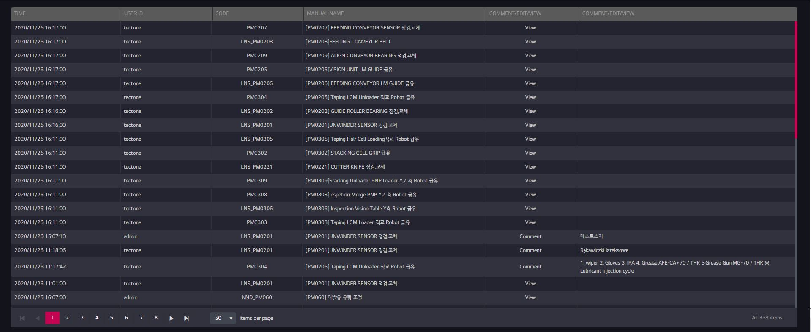

# 간단하게 Grid 그려보기

개요 :  Kendo UI를 사용하여 그리드를 그려보자 



### 가. SQL 작성

해당 그리드를 그리기 위해선 우선적으로 3개의 테이블 조인이 필요했다. 

메뉴얼의 코드정보는 t_pm_code 테이블에 있다.

메뉴얼의 코멘트정보는 t_pm_comment 테이블에 있다. 

메뉴얼의 접속로그 정보는 t_pm_access_log 테이블에 있다. 

### 기존에 작성한 SQL

```sql
SELECT to_char(a1.log_dt,'YYYY/MM/DD HH24:MI:SS') as log_dt
			  ,a1.user_id as user_id
	  		  ,a1.pm_code as pm_code 
	  		  ,a3.maintenance_name_en 
	  		  ,replace(access_type,'Search','View') as access_type
	  		  ,a2.comment_text as comment_text
	FROM t_pm_access_log a1  
	LEFT OUTER JOIN t_pm_comment a2 
	ON a1.manual_id = a2.manual_id
	AND a1.pm_code = a2.pm_code 
	INNER JOIN t_pm_code a3  
	ON a1.manual_id = a3.manual_id
	AND a1.pm_code = a3.pm_code 
	ORDER BY a1.log_dt desc;
```

1. 처음에 작성한  SQL문의 경우  LEFT OUTER JOIN 과 INNER JOIN을 활용한 SQL 코드 작성이었다.

    그러나 외부조인과 내부조인으로 중복된 데이터들이 생성되 데이터 정확성이 떨어져 SQL 문을 변경해야 했다. 

### 수정한 SQL

```sql
SELECT  
	 log_dt
	,user_id
	,t2.pm_code
	,t3.maintenance_name_en
	,replace(access_type,'Search','View') as access_tpye
	,t2.comment_text 
	FROM (
SELECT 
	to_char(log_dt,'YYYY/MM/DD HH24:MI:SS') as log_dt
	,t1.user_id
	,t1.manual_id
	,t1.access_type 
	,t1.pm_code
	,NULL as comment_text
	FROM t_pm_access_log t1
UNION ALL
SELECT  
	to_char(log_dt,'YYYY/MM/DD HH24:MI:SS') as log_dt
	,t2.user_id
	,t2.manual_id 
	,'Comment'access_type 
	,t2.pm_code 
	,t2.comment_text
FROM t_pm_comment t2
) t2
    INNER JOIN t_pm_code t3
	ON t2.manual_id =t3.manual_id 
	AND t2.pm_code = t3.pm_code 
	ORDER BY log_dt DESC;
```

1. UINION ALL의 사용 : UNION의 경우 중복값을 제거하여 출력하지만 UNIONALL의 경우 중복값을 포함하여 출력함
