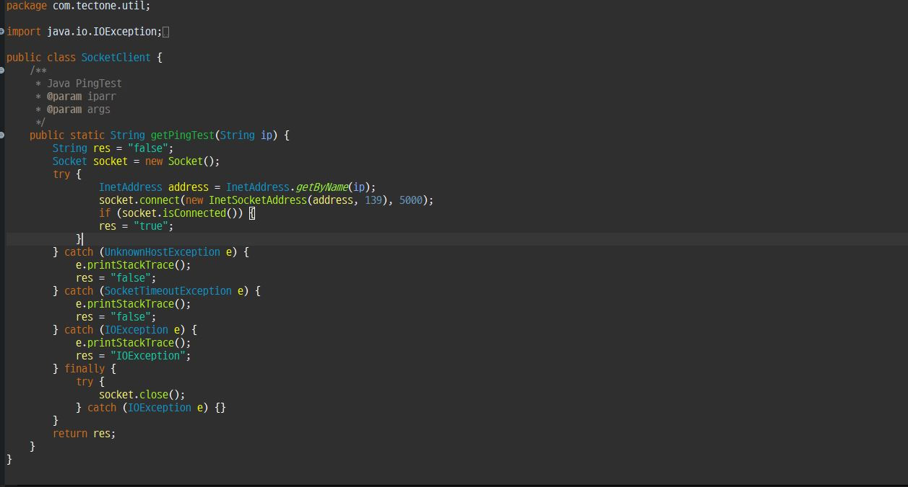
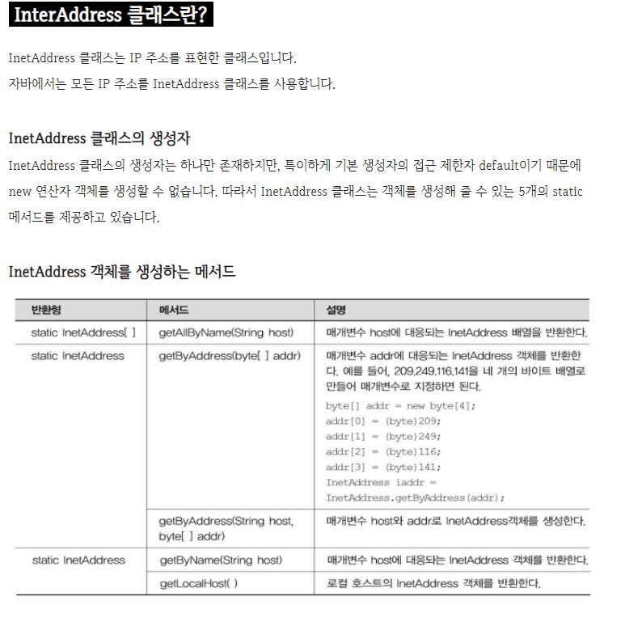
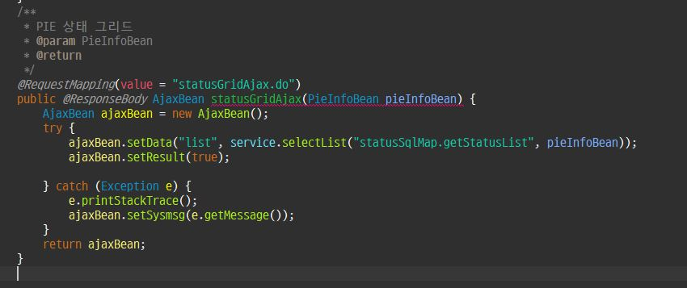
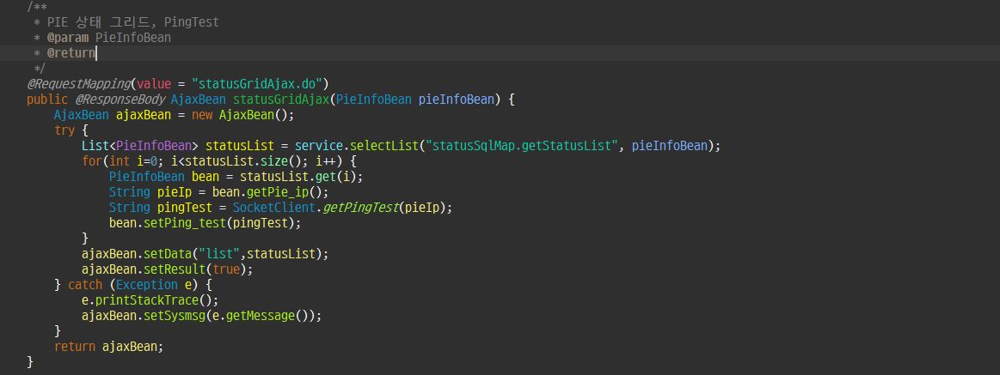

2020.10.06

## 간단하게 PingTest 구현해보기 

1. **Java PingTest Class**

​    (1). 파라미터는 String 타입으로 받는다.

​    (2). 연결 테스트를 위해 소켓을 열어 준다 => Socket socket = new Socket();

​    (3). 해당 클래스는 try&catch 문 사용

2. **InetAddress**

​     (4). InetAddress 클래스를IP주소를 적용하기 위해 사용하였고 address라는 변수에 할당하였다. => 			InetAddress address = InetAddress.getByName(ip);  

​    (5). 2번에서 선언한 소켓을 address 변수를 담아 연결한다 => 

​			socket.connect(new InetSocketAddress(address,139), 5000);

​    (6). 소켓에 연결된 어드레스로 핑테스트가 성공 했을때 조건을 작성한다

​			(성공하면 문자열 "true"를 반환 ).

​        	=> if (socket.isConnected()) {res ="true"}

​    (7). 나머지는 "false" 를 예외처리에는 false 를 반환한다.

 **StatusCont.java (Controller 단 처리)**

 

#### JSON 데이터를 넘겨서 그리드를 그리는 컨트롤러   => 기존에서 수정되야 하는 사항

​    (8). ajaxBean.setData("list",service.selectList("statusSqlMap.getStatusList",pieInfoBean));

​    (9).  ("statusSqlMap.getStatusList",pieInfoBean) 값은 해시맵 형태로 반환되며 1번에     

​            service.selectList 로 리스트에 담긴다

​    (10).  service.selectList("statusSqlMap.getStatusList",pieInfoBean) 안에 있는 pie_ip 값이 위에 

​             핑테스트 클래스를 타고 가야한다. 

   <수정된 코드> 

​       (11).  리스트로 담긴 값을 statusList 변수에 할당한다.

​       (12).  statusList.get(i) => for 문이 돌아가는 i 만큼 해 리스트의 bean 값들을 가져온다

​       (13). 가져온 bean(VO) 안에 .getPie_ip(); 로 bean 안에 세팅된 ip 주소들을 pieIp 변수에 전부 

​				할당한다. 

​       (14).  pieIp를 Java Ping 테스트 클래스를 타게 하고 값을 다시 bean Ping_test에 세팅한다.
