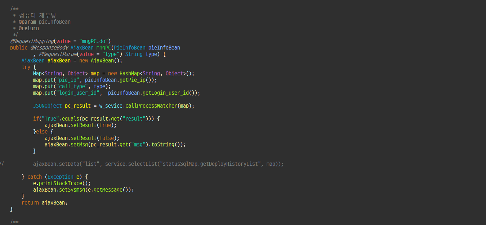
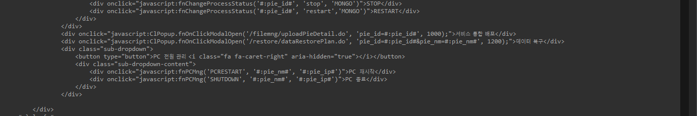
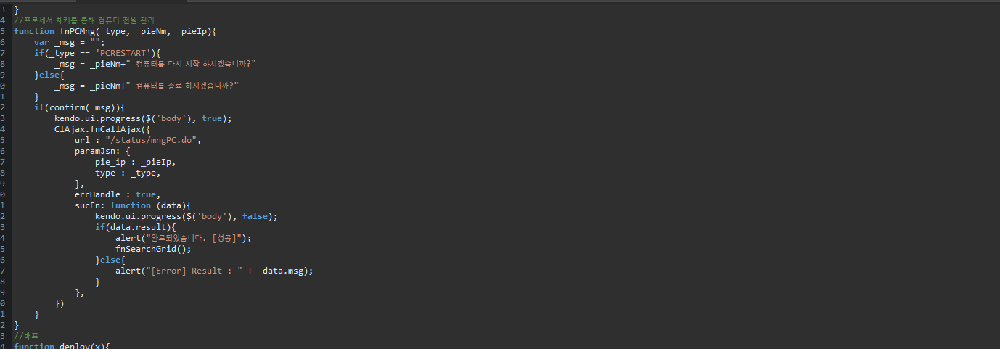

# 간단하게 파라미터 값 주고 받기

 프로그램에서 Ajax로 값 주고 받기(PIE 재부팅, 종료관리) 

# Java Controller 단



```java
@RequestParam(value = "type") Strint type 
```

1. callProcessWatcher 라는 메서드는 Map으로 파라미터 값을 받는데 Map에는 필수적으로 들어가야 하는 값이 3가지이다(pie_ip, call_type,login_user_id)
2. 이번 정리에서는 type 값을 RequestParam으로 Ajax를 통해 받아본다.

 3.  (1) @RequestParam(value ="type") String type  [주의] 여기서 value 값을 Jquery에서 넘겨줄때 인자 값을 동일하게 적어야 한다!

# JS/JSP 단





```jsx
function fnPCMng(_type, _pieNm, _pieIp){
	var _msg = "";
	if(_type == 'PCRESTART'){
		_msg = _pieNm+" 컴퓨터를 다시 시작 하시겠습니까?"
	}else{
		_msg = _pieNm+" 컴퓨터를 종료 하시겠습니까?"
	}
	if(confirm(_msg)){
		kendo.ui.progress($('body'), true);
		ClAjax.fnCallAjax({
			url : "/status/mngPC.do",
			paramJsn: {
				pie_ip : _pieIp,
				type : _type,
			},
			errHandle : true,
			sucFn: function (data){
				kendo.ui.progress($('body'), false);
				if(data.result){
       				alert("완료되었습니다. [성공]");
					fnSearchGrid();
	   			}else{
	   				alert("[Error] Result : " +  data.msg);
	   			}
			},
		})
	}
}
```

1. function fnPCMng를 작성한다 이때 나머지 파라미터를 제외하고 _type으로 JSP 에서 받는 파라미터를 하나 추가해 준다.
2. url : (넘겨주는 컨트롤러), paramJsn : (넘겨야하는 값) 여기서 type : _type으로 type에 _type 값이 담겨져서 넘어간다.

3.   JSP 에서 <div onclick = "javascript : fnPCMng( '_type', '_pieNm', '_pieIp')> 값으로 넘기면 된다.

4. 따라서 **Java Controller단**  에 'PCRESTART' 값 혹은 'SHUTDOWN' 값이 들어가게 된다.
