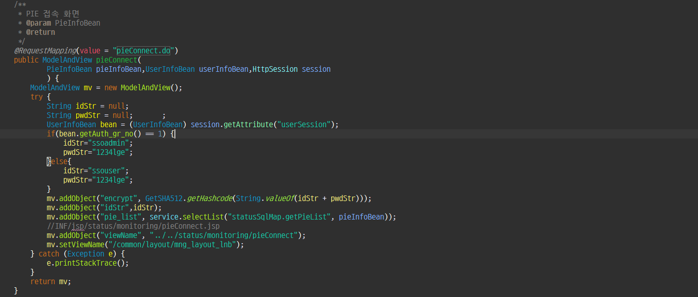
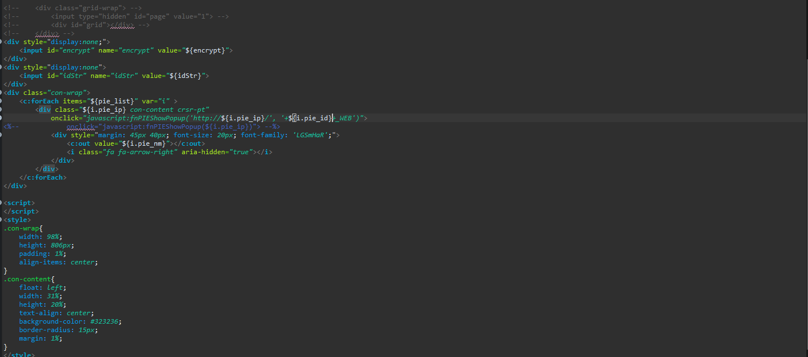
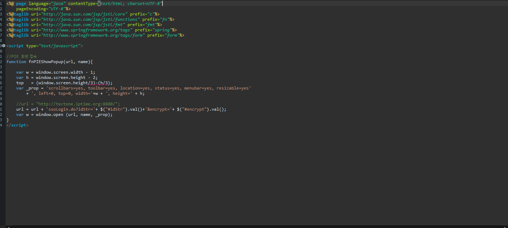
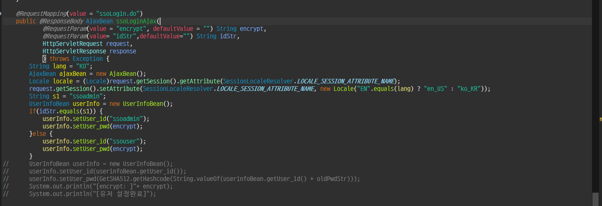

# 간단한 session.getAttribute 사용하기

# 간단한 session.getAttribute 사용하기

FOG에서 ssouser를 넣을 때 ssouser를 PIE에서 2종류로 변경 ssouser / ssoadmin

개요 : FOG에 접속한 세션에서 사용자 권한을 분기하여 해당 권한에 따라 같은 권한으로 로그인 하도록 해야했다

# LG_FOG_V1 프로젝트

### 가. pieConnect.do

1. UserInfoBean에는 VO 객체로 Auth_gr_no의 getter/setter는 이미 설정되어있음

 2. Session에서 getAttribute를 하여 값을 가져오려 하는데 이때 key가 "userSession"이다.

 3. 이후 UserInfoBean 형태의 value 값(Auth_gr_no) 이기 때문에 UserInfoBean으로 파싱(형변환) 후    

     bean으로 지정해준다

 4. bean.Auth_gr_no에 따라 권한을 분기하여 세팅해준다. (관리자 혹은 유저 )

 5. 나머지는 값을 뷰에 넘기는 작업 (여기서 encrypt는 아이디랑 비밀번호를 암호화 처리해서 비밀번     

     호로 사용하고 idStr로 아이디 값도 같이 넘겨준다)

### 나. pieConnect.jsp

1. input 타입으로 간단하게 encrypt와 idStr값을 받아준다 . (display:none 처리)

### 다. pieConnect.jsp

1. fnPIEShowPopup은 url과 접속하고자 하는 pie이름을 받아 클릭 시 팝업 형태로 보여주는 function

    이다.

2. 파라미터 값을 PIE에 보내기 위해 get방식으로 url에 (나)에서 작성한 encrypt값과 idStr 값을 url로  

   작성한다.

**'ssoLogin.do?idStr = '+ $("#idStr").val() + '&encrypt=' + $("#encrypt").val();** ==>요렇게 파라미터 값을 넘겨준다

# LG_TP_PIE_V1 프로젝트

### 라. PIE 로그인 로직 처리하기

1. @RequestParam(value="encrypt" defaultValue= "" ) String encrypt, @RequestParam(value="idStr", defaultValue = "" ) String idStr FOG에서 보낸 파라미터 값 2개를 이렇게 받아본다.
2. equals를 사용해서 해당 문자값이랑 idStr 값을 비교해보고 분기하여 세팅한다.